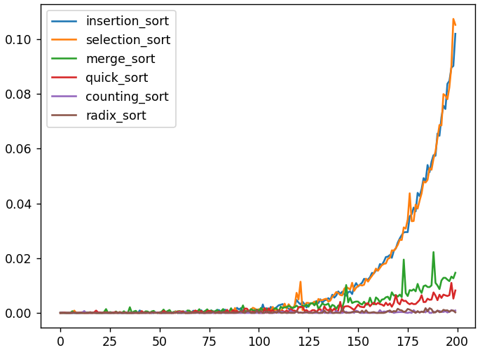
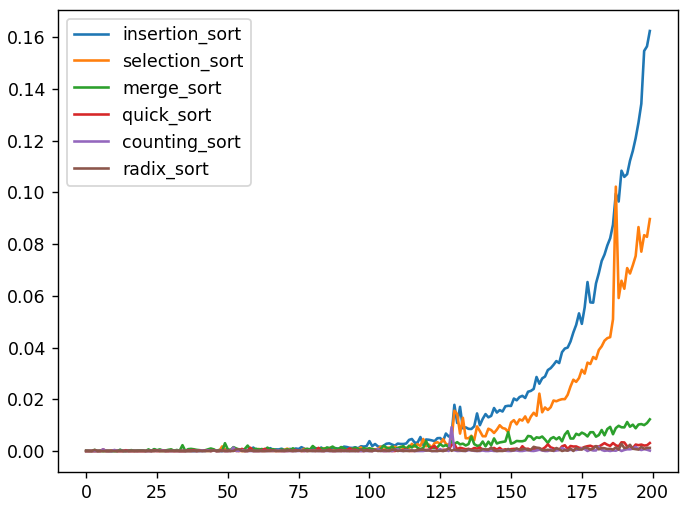
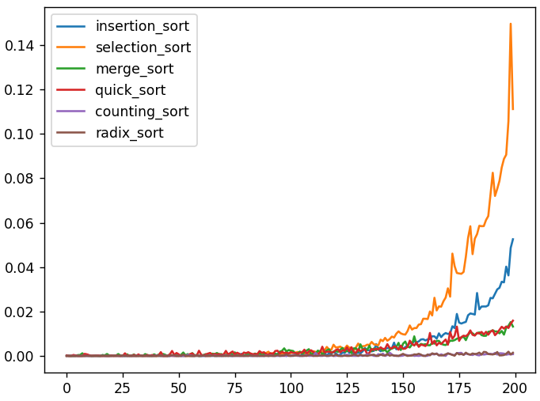
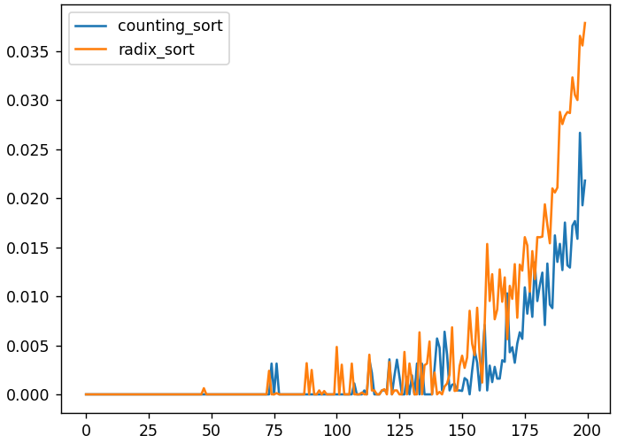

### General sorting algorithms, compared

This is a small project where I simply compare different sorting algorithms with each other, having implemented them in C++ and running them using Python.

The currently implemented algorithms are:

-insertion sort  
-selection sort  
-quicksort  
-mergesort  
-counting sort  
-radix sort  

#### Overview of each file

The following files act as independent tests for each algorithm in a certain setting, where there are specific conditions to and aspects of the array to be sorted.

##### general_test.py

A general test, where I test each algorithm a few times, record the time it took and compare directly by drawing a graph.

Array lengths used: from length 100 to 10,000 (equally distributed in log-space)

##### part_cte_test.py

An edge case test where the array to be sorted is partially constant (many integers are the same).

Array lengths used: from length 100 to 10,000 (equally distributed in log-space)

##### part_random_test.py

An edge case test where the array to be sorted is partially sorted already.

Array lengths used: from length 100 to 10,000 (equally distributed in log-space)

##### general_test_faster_algos.py

A general test where I exclude the $n^2$ time complexity algorithms (insertion and selection sort) and compare the faster algorithms.

Array lengths used: from length 100 to 100,000 (equally distributed in log-space)

##### general_test_fastest_algos.py

Another general test where I only consider counting and radix sort and compare the two fastest ones.

Array lengths used: from length 100 to 400,000 (equally distributed in log-space)

